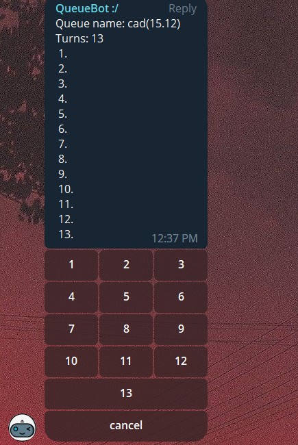
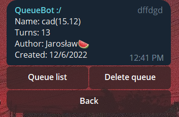

# Telegram-bot

## https://t.me/QueueIK13Bot - link

### Bot for creating queues using Telegram

---

## Technologies

- Rest API (Nest.js, PrismaClient)
- Client (node-telegram-api, axios)
- Hosted with Heroku

## Examples

- Queue

- Queue-controls

